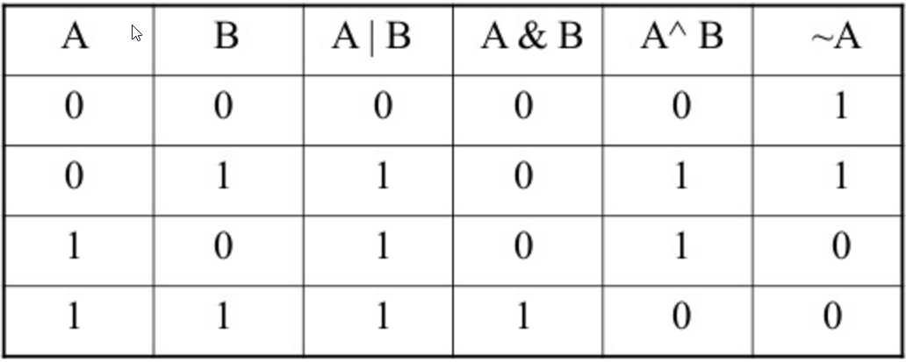

# 0x14. C - Bit manipulation 



## Resource

- [Number Systems Introduction](https://www.youtube.com/watch?v=FFDMzbrEXaE&t=2s)
- [How to add and minus binary numbers](https://youtu.be/C5EkxfNEMjE)
- [Binary ..](https://youtu.be/RrJXLdv1i74)
- [Binary Addition and Subtraction With Negative Numbers](https://youtu.be/sJXTo3EZoxM)
- [Bitwise Operators in C part 1](https://youtu.be/jlQmeyce65Q)
- [Bitwise Operators in C part 2](https://youtu.be/8aFik6lPPaA)
- [Bitwise Operators in C part 3](https://youtu.be/GhhJP6vpEA8)
- [Bitwise Operators in C part 4](https://youtu.be/kYR5biY4OHw)
- [Algorithms: Bit Manipulation](https://youtu.be/NLKQEOgBAnw)

---

- Below are some notes on `~`, `>>` and `<<` bitwise operators.

- NOT operator `~`
	- Result is `0` when bit is `1` and `1` when bit is `0`

- Right Shift `>>`
	- `leftOperand` >> `rightOperand`
		- leftOperand: whose bits get right shifted
		- rightOperand: Decides number of places to shift the bits
		- Example: `0x02 >> 1` = `0x01`
	- When bits are shifted right the leading positions are filled with zeros
	- It is equivalent to division by 2<sup>rightOperand</sup>
		- Example: `0x02` >> `1` == `0x02` / 2<sup>1</sup>

- Left Shift `<<`
	- `leftOperand` << `rightOperand`
		- leftOperand: whose bits get right shifted
		- rightOperand: Decides number of places to shift the bits
		- Example: `0x01 << 1` = `0x02`
	- When bits are shifted left the trailing positions are filled with zeros
	- It is equivalent to multiplication by 2<sup>rightOperand</sup>
		- Example: `0x01` << `1` == `0x01` / 2<sup>1</sup>

## Tasks

- All `*-main.c` are in the [main](./main) directory.

---

0. [0](./0-binary_to_uint.c) : A function that converts a binary number to an `unsigned int`.
	- Prototype: `unsigned int binary_to_uint(const char *b);`
	- Where `b` is pointing to a string of `0` and `1` chars.
	- Return: the converted number, or 0 if
		- there is one or more chars in the string `b` that is not `0` or `1`
		- `b` is `NULL`
	- To enable debug mode that will print statements of what is happening add this `-D DEBUG` at the end of the compile line.
	- Compile the code this way: `gcc -Wall -pedantic -Werror -Wextra -std=gnu89 main/0-main.c 0-binary_to_uint.c -o a`
1. [1](./1-print_binary.c) : A function that prints the binary representation of a number.
	- Prototype: `void print_binary(unsigned long int n);`
	- Format: see below.
		```sh
		julien@ubuntu:~/0x14. Binary$ ./b 
		0
		1
		1100010
		10000000000
		10000000001
		julien@ubuntu:~/0x14. Binary$
		```
	- You are not allowed to use arrays.
	- You are not allowed to use `malloc`
	- You are not allowed to use the `%` or `/` operators.
	- If you are here for a solution for ALX, [checker version](https://github.com/iAmG-r00t/alx-low_level_programming/blob/48e0fcf3b39930ff4339b57e559115ad069f2775/0x14-bit_manipulation/1-print_binary.c).
	- To enable debug mode that will print statements of what is happening add this `-D DEBUG` at the end of the compile line.
	- Compile the code this way: `gcc -Wall -pedantic -Werror -Wextra -std=gnu89 main/1-main.c 1-print_binary.c _putchar.c -o b`
2. [10](./2-get_bit.c) : A function that returns the value of a bit at a given index.
	- Prototype: `int get_bit(unsigned long int n, unsigned int index);`
	- Where `index` is the index, starting from `0` of the bit you want to get.
	- Returns: the value of the bit at index `index` or `-1` if an eror occured.
	- To enable debug mode that will print statements of what is happening add this `-D DEBUG` at the end of the compile line.
	- Compile the code this way: `gcc -Wall -pedantic -Werror -Wextra -std=gnu89 main/2-main.c 2-get_bit.c -o c`
3. [11](./3-set_bit.c) : A function that sets the value of a bit to `1` at a given index.
	- Prototype: `int set_bit(unsigned long int *n, unsigned int index);`
	- where `index` is the index, starting from `0` of the bit you want to set.
	- Returns: `1` if it worked, or `-1` if an error occurred.
	- To enable debug mode that will print statements of what is happening add this `-D DEBUG` at the end of the compile line.
	- Compile the code this way: `gcc -Wall -pedantic -Werror -Wextra -std=gnu89 main/3-main.c 3-set_bit.c -o d`
4. [100](./4-clear_bit.c) : A function that sets the value of a bit to `0` at a given index.
	- Prototype: `int clear_bit(unsigned long int *n, unsigned int index);`
	- Where `index` is the index, starting from `0` of the bit you want to set.
	- Returns: `1` if it worked, or `-1` if an error occured.
	- To enable debug mode that will print statements of what is happening add this `-D DEBUG` at the end of the compile line.
	- Compile the code this way: `gcc -Wall -pedantic -Werror -Wextra -std=gnu89 main/4-main.c 4-clear_bit.c -o e`
5. [101](./5-flip_bits.c) : A function that returns the number of bits you would need to flip to get from one number to another.
	- Prototype: `unsigned int flip_bits(unsigned long int n, unsigned long int m);`
	- You are not allowed to use the `%` or `/` operators.
	- If you are here for a solution for ALX, [checker version](https://github.com/iAmG-r00t/alx-low_level_programming/blob/0377351dc5aa5ff7bf5f41869b69165c878d5a36/0x14-bit_manipulation/5-flip_bits.c).
	- To enable debug mode that will print statements of what is happening add this `-D DEBUG` at the end of the compile line.
	- Compile the code this way: `gcc -Wall -pedantic -Werror -Wextra -std=gnu89 main/5-main.c 5-flip_bits.c -o f`
6. [Endianness](./100-get_endianness.c) : A function that checks the endianness.
	- Prototype: `int get_endianness(void);`
	- Returns: `0` if big endian, `1` if little endian.
	- Read more about it [here](https://cs-fundamentals.com/tech-interview/c/c-program-to-check-little-and-big-endian-architecture).
	- Confirm your architecture version:
		```sh
		julien@ubuntu:~/0x14. Binary$ lscpu | head
		Architecture:          x86_64
		CPU op-mode(s):        32-bit, 64-bit
		Byte Order:            Little Endian
		CPU(s):                1
		On-line CPU(s) list:   0
		Thread(s) per core:    1
		Core(s) per socket:    1
		Socket(s):             1
		NUMA node(s):          1
		Vendor ID:             GenuineIntel
		julien@ubuntu:~/0x14. Binary$
		```
	- Compile the code this way: `gcc -Wall -pedantic -Werror -Wextra -std=gnu89 main/100-main.c 100-get_endianness.c -o h`
7. [Crackme3](./101-password) : Find the password for this [program](https://github.com/holbertonschool/0x13.c/blob/master/crackme3).
	- Get the file this way: `curl -fsSL https://raw.githubusercontent.com/holbertonschool/0x13.c/master/crackme3 -o crackme3`
	- Will revisit this challenge and explain how to solve it.
